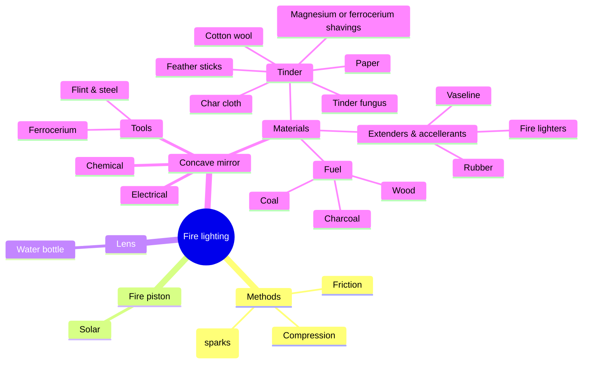
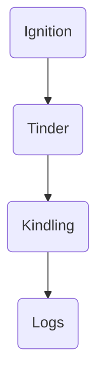

# Fire lighting

Concave mirror
* https://www.philipharris.co.uk/product/physics/waves/light-waves/concave-mirrors-50mm-dia-f200-pack-of-10/pp00054644

Convex lens
* https://www.philipharris.co.uk/product/physics/waves/light-waves/double-convex-spherical-lenses-plus10d,-fl100mm-pack-of-5/b8l27157

<table>
<tr><th>Level</th><th>Ignition/heat</th><th>Tinder</th><th>Extender</th><th>Kindling</th><th>Fuel</th></tr>
<tr><td>1</td><td>Consumable (matches or lighters)</td><td>Consumable (cotton wool, bought tinder products)</td><td>Fire lighters</td><td>Bagged dry</td><td>Kiln dried logs</td></tr>
<tr><td>2</td><td>Durable (sparks from ferrocerium rods, flint & steel etc.)</td><td>Consumable (cotton wool, bought tinder products)</td><td>Wax, petroleum jelly, rubber</td><td>Bagged dry</td><td>Kiln dried logs</td></tr>
<tr><td>3</td><td>Durable (sparks from ferrocerium rods, flint & steel etc.)</td><td>Consumable (cotton wool, bought tinder products)</td><td>Made on site (feather sticks)</td><td>Bagged dry</td><td>Kiln dried logs</td></tr>
<tr><td>4</td><td>Durable (sparks from ferrocerium rods, flint & steel etc.)</td><td>Consumable (cotton wool, bought tinder products)</td><td>Made on site (feather sticks)</td><td>Found and processed on site</td><td>Found and processed on site</td></tr>
<tr><td>5</td><td>Durable (sparks from ferrocerium rods, flint & steel etc.)</td><td>Renewable on site (char cloth or moss)</td><td>Made on site (feather sticks)</td><td>Found and processed on site</td><td>Found and processed on site</td></tr>
<tr><td>6</td><td>Durable (sparks from ferrocerium rods, flint & steel etc.)</td><td>Found on site (punk wood, dry shavings, grasses)</td><td>Made on site (feather sticks)</td><td>Found and processed on site</td><td>Found and processed on site</td></tr>
<tr><td>7</td><td>Durable (sparks from ferrocerium rods, flint & steel etc.)</td><td>Found on site (punk wood, dry shavings, grasses)</td><td>Made on site (feather sticks)</td><td>Found and processed on site</td><td>Found and processed on site</td></tr>
</table>

## Ignition

1. Consumable (matches or lighters)
2. Durable (sparks from ferrocerium rods, flint & steel etc)
3. Permanent (compression and lenses)
4. On site (friction from bows and ploughs)

## Tinder

1. Consumable (cotton wool, bought tinder products)
2. Renewable on site (char cloth or moss)
3. Found on site (punk wood, dry shavings, grasses)

## Extenders

1. Fire lighters
2. Wax, petroleum jelly, rubber
3. Made on site (feather sticks)

## Kindling

1. Brought from off site
2. Found on site

## Logs

1. Brought from off site
2. Found on site
