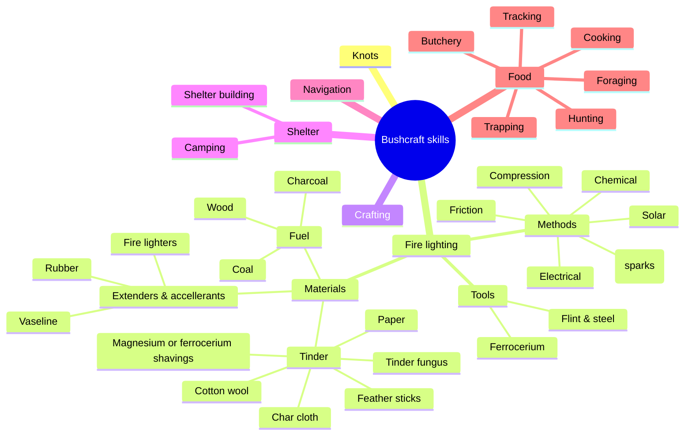
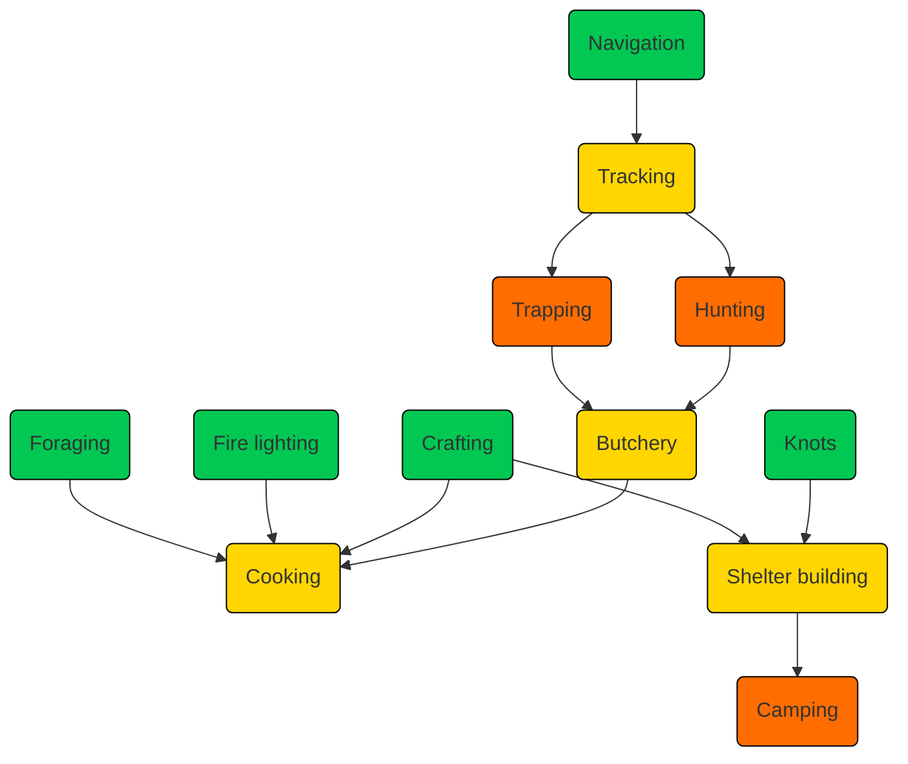

# Bushcraft skills

* [Knots](knots)
* [Fire lighting](firelighting)
* [Cooking](cooking)
* [Crafting](crafting)
* [Cordage](cordage)
* [Shelter building](shelterbuilding)
* [Camping](camping)
* [Foraging](foraging)
* [Navigation](navigation)
* [Butchery](butchery)
* [Tracking](tracking)
* [Trapping](trapping)
* [Hunting](hunting)

