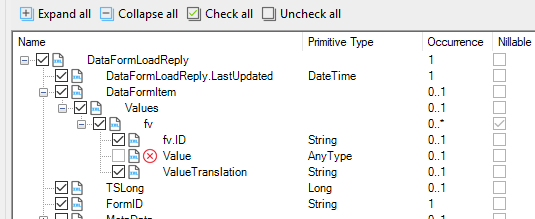
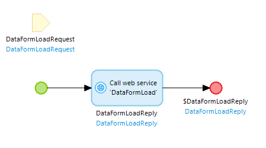
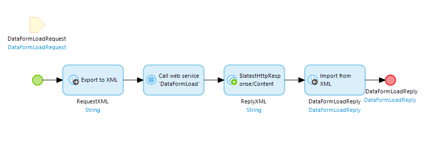
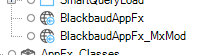

Using XSLT to handle unsupported XML constructs in Mendix import and export mappings
===

or

Java is not the only way
===

Mendix makes communicating with other systems using webservices very easy. Just 
import the service definition, pick your action and let Mendix generate mappings
and entities for the request and response.



Oh dear. The Value node is the one that contains the data that we want to 
retrieve! This means that we cannot use an import mapping to read the returned 
data. Offered suggestions on how to manage this situation were, to say the least, 
unhelpful:
  * "Don't use that node" – well yes, but then we would not have the data!
  * "Change the XML schema" – it is a wsdl from a third party system, so I can't 
    change it!
  * "Do it in Java" – the ultimate last resort, but such a shame not to be able 
    to use the easily configuratble import and export mappings that Mendix worked 
    so hard to provide us with!

Just for completeness, when we want to call the reciprocal action "DataFormSave", 
we need to be able to export the same structure.

Let’s look at this another way. There are two conflicting requirements:
  1. We need the schema provided by the external service in order to communicate 
     with the service.
  2. We need a different schema to feed into a Mendix mapping.

What if we could separate these requirements and change the schema in between 
these two steps?

Step 1: separating the schemas
---

Normally we would call the import and export mappings from within the web service 
call action.



Instead, we are going to apply the mappings outside the web service call action, 
which gives us access to the XML both before and after.



Let’s have a look at the schema from the wsdl for a moment. Searching for 
“DataFormLoadReply” found us the type of the reply element. From here we can do 
another search for the definition of our DataFormItem element.

```xml
<s:schema elementFormDefault="qualified" targetNamespace="bb_appfx_dataforms">
	<s:complexType name="DataFormItem">
		<s:sequence>
			<s:element minOccurs="0" maxOccurs="1" name="Values">
				<s:complexType>
					<s:sequence>
						<s:element minOccurs="0" maxOccurs="unbounded" name="fv" nillable="true" type="s47:DataFormFieldValue" />
					</s:sequence>
				</s:complexType>
			</s:element>
		</s:sequence>
	</s:complexType>
	<s:complexType name="DataFormItemArrayValue">
		<s:sequence>
			<s:element minOccurs="0" maxOccurs="1" name="Items" type="s47:ArrayOfDataFormItem" />
		</s:sequence>
	</s:complexType>
	<s:complexType name="ArrayOfDataFormItem">
		<s:sequence>
			<s:element minOccurs="0" maxOccurs="unbounded" name="DataFormItem" nillable="true" type="s47:DataFormItem" />
		</s:sequence>
	</s:complexType>
	<s:complexType name="DataFormFieldValue">
		<s:sequence>
			<s:element minOccurs="0" maxOccurs="1" name="Value" />
			<s:element minOccurs="0" maxOccurs="1" name="ValueTranslation" type="s:string" />
		</s:sequence>
		<s:attribute name="ID" type="s:string" />
	</s:complexType>
</s:schema>
```

So here we can see our problem element: "Value". The issue is that the "type" 
attribute is missing, which means that it can actually hold data of any type. 
Mendix doesn’t do an "Any" type. Let's see if we can come up with something that 
Mendix can handle, by giving it a type and allowing that type to contain a 
discrete element for each of the potential types of data it can contain; which, 
just to make things difficult, includes an array of other DataFormFieldValues and 
a guid from a different namespace:

```xml
<s:complexType name="DataFormFieldValue">
	<s:sequence>
		<s:element minOccurs="0" maxOccurs="1" name="Value" type="s47:mx_anytype" />
		<s:element minOccurs="0" maxOccurs="1" name="ValueTranslation" type="s:string" />
	</s:sequence>
	<s:attribute name="ID" type="s:string" />
</s:complexType>
<s:complexType name="mx_anytype">
	<s:sequence>
		<s:element minOccurs="0" maxOccurs="1" name="booleanval" type="s:boolean" />
		<s:element minOccurs="0" maxOccurs="1" name="stringval" type="s:string" />
		<s:element minOccurs="0" maxOccurs="1" name="intval" type="s:int" />
		<s:element minOccurs="0" maxOccurs="1" name="longval" type="s:long" />
		<s:element minOccurs="0" maxOccurs="1" name="dateTimeval" type="s:dateTime" />
		<s:element minOccurs="0" maxOccurs="1" name="doubleval" type="s:double" />
		<s:element minOccurs="0" maxOccurs="1" name="floatval" type="s:float" />
		<s:element minOccurs="0" maxOccurs="1" name="decimalval" type="s:decimal" />
		<s:element minOccurs="0" maxOccurs="1" name="integerval" type="s:integer" />
		<s:element minOccurs="0" maxOccurs="1" name="dateval" type="s:date" />
		<s:element minOccurs="0" maxOccurs="1" name="base64Binaryval" type="s:string" />
		<s:element minOccurs="0" maxOccurs="1" name="unsignedLongval" type="s:unsignedLong" />
		<s:element minOccurs="0" maxOccurs="1" name="unsignedByteval" type="s:unsignedByte" />
		<s:element minOccurs="0" maxOccurs="1" name="positiveIntegerval" type="s:positiveInteger" />
		<s:element minOccurs="0" maxOccurs="1" name="guidval" type="s1:guid" />
		<s:element minOccurs="0" maxOccurs="1" name="DataFormItemArrayValueval" type="s47:DataFormItemArrayValue" />
	</s:sequence>
</s:complexType>
```
 
Now we need to save this wsdl as a file and import it into Mendix as a separate 
service definition:


 
Now we have two web services: one that we can map and one that we can call.

Now all we need is a reliable way to transform one xml schema into a different one…

Oh! Hang on! That is exactly what XSLT is for!

Step 2: transforming the xml
---

Except that Mendix doesn’t do much in the way of XML tools. This is definitely a 
case for a custom Java action. I used a pretty simple bit of code using the Saxon 
XSLT library to take an input XML string and an input XSLT stylesheet and output a 
new XML string (you can find it in the App Store). Now that we can transform our 
XML, we can carry on!

What we need to do here is reproduce the same XML document, but with a few changes.
Fortunately, much cleverer people than I have come up with a technique called the 
"Identity Transform", which does exactly this in suspiciously little code (5 lines 
to be exact). Have a look at https://en.wikipedia.org/wiki/Identity_transform and 
http://dh.obdurodon.org/identity.xhtml for a description of how this works.

Now we have add the namespaces we need and add more templates to make the actual 
changes to the schema: 

```xml
<xsl:stylesheet version="2.0" xmlns:xsl="http://www.w3.org/1999/XSL/Transform"  
  xmlns:xsi="http://www.w3.org/2001/XMLSchema-instance" 
  xmlns:xsd="http://www.w3.org/2001/XMLSchema"
  xmlns:q1="http://microsoft.com/wsdl/types/"
  xmlns:bb="bb_appfx_dataforms">
    <xsl:output method="xml" indent="no"/>

        <xsl:template match="@* | node()">
		<xsl:copy>
			<xsl:apply-templates select="@* | node()"/>
		</xsl:copy>
	</xsl:template>

	<xsl:template match="bb:Value">
		<xsl:copy>
			<xsl:choose>
				<xsl:when test="contains( @xsi:type, '':'' )">
					<xsl:variable name="valueType" select="substring-after( @xsi:type, '':'' )" />
					<xsl:element name="{$valueType}val">
						<xsl:apply-templates />               
					</xsl:element>
				</xsl:when>
				<xsl:otherwise>
					<xsl:element name="{@xsi:type}val">
						<xsl:apply-templates />               
					</xsl:element>
				</xsl:otherwise>
			</xsl:choose>
		</xsl:copy>
	</xsl:template>

</xsl:stylesheet>
```

The reciprocal transformation is a bit more tricky, as we neeed to create a template for each possible type:

```xml
<xsl:stylesheet version="2.0" xmlns:xsl="http://www.w3.org/1999/XSL/Transform"  
  xmlns:xsi="http://www.w3.org/2001/XMLSchema-instance" 
  xmlns:xsd="http://www.w3.org/2001/XMLSchema"
  xmlns:blac="Blackbaud.AppFx.WebService.API.1" 
  xmlns:bb="bb_appfx_dataforms">
	<xsl:output method="xml" indent="yes"/>
	<!-- Uses the XSLT Identity Transform pattern (see https://en.wikipedia.org/wiki/Identity_transform and http://dh.obdurodon.org/identity.xhtml for help) -->

	<xsl:template  match="@* | node()">
		<xsl:copy>
			<xsl:apply-templates select="@* | node()"/>
		</xsl:copy>
	</xsl:template>

	<xsl:template match="bb:Values/bb:fv/bb:Value[bb:stringval]">
		<xsl:copy>
			<xsl:attribute name="xsi:type">xsd:string</xsl:attribute>
			<xsl:value-of select="bb:stringval"/>
		</xsl:copy>
	</xsl:template>

	<xsl:template match="bb:Values/bb:fv/bb:Value[bb:integerval]">
		<xsl:copy>
			<xsl:attribute name="xsi:type">xsd:integer</xsl:attribute>
			<xsl:value-of select="bb:integerval"/>
		</xsl:copy>
	</xsl:template>

	<xsl:template match="bb:Values/bb:fv/bb:Value[bb:decimalval]">
		<xsl:copy>
			<xsl:attribute name="xsi:type">xsd:decimal</xsl:attribute>
			<xsl:value-of select="bb:decimalval"/>
		</xsl:copy>
	</xsl:template>

	<xsl:template match="bb:Values/bb:fv/bb:Value[bb:dateval]">
		<xsl:copy>
			<xsl:attribute name="xsi:type">xsd:date</xsl:attribute>
			<xsl:value-of select="bb:dateval"/>
		</xsl:copy>
	</xsl:template>

	<xsl:template match="bb:Values/bb:fv/bb:Value[bb:dateTimeval]">
		<xsl:copy>
			<xsl:attribute name="xsi:type">xsd:dateTime</xsl:attribute>
			<xsl:value-of select="bb:dateTimeval"/>
		</xsl:copy>
	</xsl:template>

	<xsl:template match="bb:Values/bb:fv/bb:Value[bb:base64Binaryval]">
		<xsl:copy>
			<xsl:attribute name="xsi:type">xsd:base64Binary</xsl:attribute>
			<xsl:value-of select="bb:base64Binaryval"/>
		</xsl:copy>
	</xsl:template>

	<xsl:template match="bb:Values/bb:fv/bb:Value[bb:guidval]">
		<xsl:copy>
			<xsl:namespace name="ms">http://microsoft.com/wsdl/types/</xsl:namespace>
			<xsl:attribute name="xsi:type">ms:guid</xsl:attribute>
			<xsl:value-of select="bb:guidval"/>
		</xsl:copy>
	</xsl:template>

	<xsl:template match="bb:Values/bb:fv/bb:Value[bb:DataFormItemArrayValueval] ">
		<xsl:copy>
			<xsl:attribute name="xsi:type">DataFormItemArrayValue</xsl:attribute>
			<xsl:apply-templates select="bb:DataFormItemArrayValueval/@* | bb:DataFormItemArrayValueval/node()" />
		</xsl:copy>
	</xsl:template>

	<xsl:template match="bb:Values/bb:fv/bb:Value[bb:booleanval][count(./*)=1]">
		<xsl:copy>
			<xsl:attribute name="xsi:type">xsd:boolean</xsl:attribute>
			<xsl:value-of select="bb:booleanval"/>
		</xsl:copy>
	</xsl:template>

</xsl:stylesheet>
```
